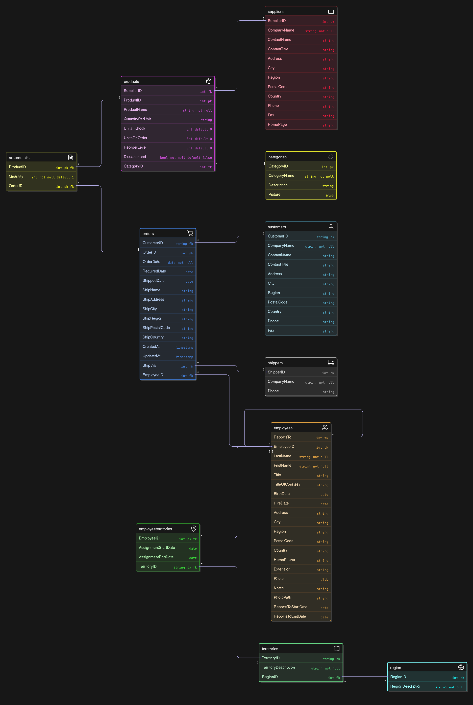
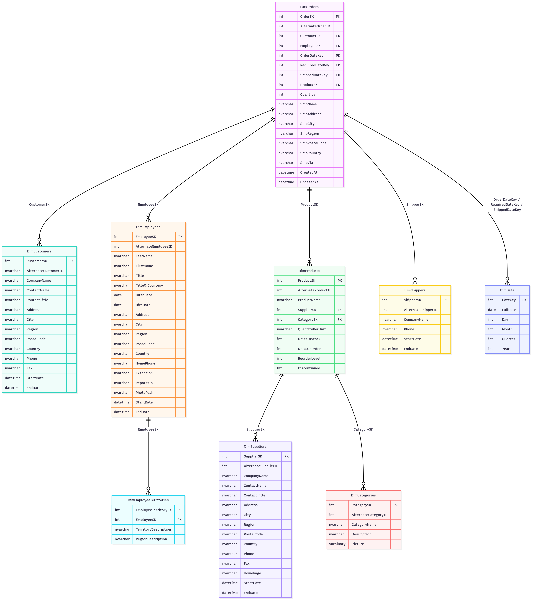

# 🏢 Northwind Data Warehouse
### *Enterprise ETL Solution with SSIS & Snowflake Schema*

<div align="center">

[](https://www.microsoft.com/sql-server)
[](https://docs.microsoft.com/en-us/sql/integration-services/)
[](#)

*A comprehensive business intelligence solution transforming operational data into analytical insights*

</div>

---

## 📋 Table of Contents
- [🎯 Project Overview](#-project-overview)
- [🏗️ Architecture](#️-architecture)
- [🔄 ETL Process](#-etl-process)
- [⚙️ Tools & Technologies](#️-tools--technologies)

---

## 🎯 Project Overview

> **Transform operational data into powerful business insights**

This project delivers a robust **data warehouse solution** for an OLTP database, leveraging **SQL Server Integration Services (SSIS)** and implementing a sophisticated **Snowflake Schema** design.

### ✨ Key Features

| Feature | Description |
|---------|-------------|
| 🎯 **Snowflake Schema** | Normalized dimensional modeling for optimal performance |
| 🔄 **SSIS ETL Pipeline** | Robust Extract, Transform, Load processes |
| 📅 **SCD Type 2** | Historical data tracking for key dimensions |
| 🛡️ **Data Quality** | Comprehensive validation and error handling |

---

## 🏗️ Architecture

### 🌟 OLTP Database E-R Diagram


### 🌟 Snowflake Schema Design

The data warehouse implements a **snowflake schema** - a normalized extension of the star schema that reduces redundancy while maintaining query efficiency.



### 🎯 Fact Table

### 📈 **FactOrders**

| Column | Type | Description |
|--------|------|-------------|
| `OrderSK` | `INT IDENTITY` | 🔑 **Primary Key** - Surrogate key |
| `AlternateOrderID` | `INT` | 🔗 Natural key from source system |
| `CustomerSK` | `INT` | 👥 Link to customer dimension |
| `EmployeeSK` | `INT` | 👤 Link to employee dimension |
| `ProductSK` | `INT` | 📦 Link to product dimension |
| `OrderDateKey` | `INT` | 📅 Order date reference |
| `RequiredDateKey` | `INT` | 📅 Required delivery date |
| `ShippedDateKey` | `INT` | 📅 Actual ship date |
| `Quantity` | `INT` | 📊 **Measure** - Order quantity |
| `ShipVia` | `NVARCHAR(100)` | 🚚 Shipping method |

**Key Features:**
- ⚡ Optimized for analytical queries
- 🔗 Foreign key relationships to all dimensions
- 📊 Contains both facts and degenerate dimensions
- 🛡️ Referential integrity maintained


### 🌟 Dimension Tables

### 👥 **DimCustomers**  
*Customer Data*  
- 🏢 Company information  
- 📍 Address & contact details  
- ⏱️ **SCD Type 2** support  
- 📊 Historical tracking  

### 👤 **DimEmployees**  
*Employee Data*  
- 👔 Personal & professional info  
- 🏗️ Organizational structure  
- 📈 Career progression tracking  
- ⏱️ **SCD Type 2** enabled  

### 📦 **DimProducts**  
*Product Data*  
- 🛍️ Product details & pricing  
- 📊 Inventory levels  
- 🔗 Category & supplier links  
- 🚨 Reorder notifications  

### 🏭 **DimSuppliers**  
*Supplier Data*  
- 🏢 Vendor information  
- 🌍 Global supplier tracking  
- ⏱️ **SCD Type 2** history  
- 📞 Contact management  

### 📅 **Special Dimensions**

| Dimension | Purpose | Key Features |
|-----------|---------|--------------|
| **🗂️ DimCategories** | Product classification | Hierarchical grouping, metadata storage |
| **🚚 DimShippers** | Logistics tracking | SCD Type 2, performance metrics |
| **🗺️ DimEmployeeTerritories** | Sales territory mapping | Geographic analysis, sales assignments |
| **📅 DimDate** | Time intelligence | Fiscal calendars |

---

## 🔄 ETL Process

### 🛠️ **ETL Features**

#### 🔄 Slowly Changing Dimensions
- ✅ Type 2 SCD implementation
- 📊 Historical data preservation
- ⚡ Efficient change detection
- 🔍 StartDate/EndDate tracking

#### 🛡️ Data Quality
- 🔍 Comprehensive validation rules
- 🧹 Data cleansing operations

### 🔧 **Stored Procedures**

<details>
<summary><strong>🗂️ UpdateDimCategories</strong> - Category dimension management</summary>

```sql
CREATE PROCEDURE dbo.UpdateDimCategories
@CategoryID INT,
@CategoryName NVARCHAR(50),
@Description NVARCHAR(MAX),
@Picture VARBINARY(MAX)
AS
BEGIN
    IF NOT EXISTS (SELECT 1 FROM dbo.DimCategories WHERE AlternateCategoryID = @CategoryID)
    BEGIN
        INSERT INTO dbo.DimCategories (
            AlternateCategoryID, CategoryName, Description, Picture,
            InsertDate, ModifiedDate
        )
        VALUES (
            @CategoryID, @CategoryName, @Description, @Picture,
            GETDATE(), GETDATE()
        );
    END
    ELSE
    BEGIN
        UPDATE dbo.DimCategories
        SET CategoryName = @CategoryName,
            Description = @Description,
            Picture = @Picture,
            ModifiedDate = GETDATE()
        WHERE AlternateCategoryID = @CategoryID;
    END
END
GO
```

**Features:**
- ✅ Upsert operations (Insert/Update)
- 🕐 Automatic timestamp management
- 🛡️ Data validation built-in
- ⚡ Optimized for bulk operations

</details>

<details>
<summary><strong>📦 UpdateDimProducts</strong> - Product dimension with relationships</summary>

```sql
CREATE PROCEDURE dbo.UpdateDimProducts
@ProductID INT,
@ProductName NVARCHAR(100),
@SupplierSK INT,
@CategorySK INT,
@QuantityPerUnit NVARCHAR(50),
@UnitsInStock INT,
@UnitsOnOrder INT,
@ReorderLevel INT,
@Discontinued BIT
AS
BEGIN
    IF NOT EXISTS (SELECT 1 FROM dbo.DimProducts WHERE AlternateProductID = @ProductID)
    BEGIN
        INSERT INTO dbo.DimProducts (
            AlternateProductID, ProductName, SupplierSK, CategorySK,
            QuantityPerUnit, UnitsInStock, UnitsOnOrder, ReorderLevel, Discontinued,
            InsertDate, ModifiedDate
        )
        VALUES (
            @ProductID, @ProductName, @SupplierSK, @CategorySK,
            @QuantityPerUnit, @UnitsInStock, @UnitsOnOrder, @ReorderLevel, @Discontinued,
            GETDATE(), GETDATE()
        );
    END
    ELSE
    BEGIN
        UPDATE dbo.DimProducts
        SET ProductName = @ProductName,
            SupplierSK = @SupplierSK,
            CategorySK = @CategorySK,
            QuantityPerUnit = @QuantityPerUnit,
            UnitsInStock = @UnitsInStock,
            UnitsOnOrder = @UnitsOnOrder,
            ReorderLevel = @ReorderLevel,
            Discontinued = @Discontinued,
            ModifiedDate = GETDATE()
        WHERE AlternateProductID = @ProductID;
    END
END
GO
```

**Features:**
- 🔗 Foreign key relationship management
- 📊 Inventory level tracking
- 🚨 Discontinued product handling

</details>

---

## ⚙️ Tools & Technologies

<table style="width: 100%; border-collapse: separate; border-spacing: 0; margin: 20px 0; border-radius: 10px; overflow: hidden;">
<tr style="background: #343a40; color: white;">
<th style="padding: 15px;">Component</th>
<th style="padding: 15px;">Version</th>
<th style="padding: 15px;">Purpose</th>
</tr>
<tr style="background: #f8f9fa;">
<td style="padding: 12px; color: black;">🗄️ <strong>SQL Server</strong></td>
<td style="padding: 12px; color: black;">2016+</td>
<td style="padding: 12px; color: black;">Database engine & SSIS runtime</td>
</tr>
<tr style="background: #e9ecef;">
<td style="padding: 12px; color: black;">🔧 <strong>SSDT</strong></td>
<td style="padding: 12px; color: black;">Latest</td>
<td style="padding: 12px; color: black;">Development environment</td>
</tr>
<tr style="background: #f8f9fa;">
<td style="padding: 12px; color: black;">💼 <strong>SSMS</strong></td>
<td style="padding: 12px; color: black;">18.0+</td>
<td style="padding: 12px; color: black;">Database management</td>
</tr>
</table>

<div align="center" style="margin: 40px 0;">
</div>

---

## 👤 Author

**Thilanka Wijesingha**  

📧 thilankawijesingha@gmail.com  
🔗 [LinkedIn](https://linkedin.com/in/thilanka-wijesingha-a88105284/)  

---

## ⭐ Like this project?

Give it a ⭐️ on GitHub to show your support!

---
